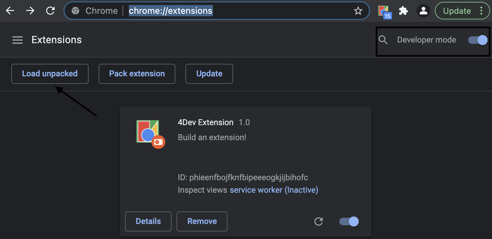
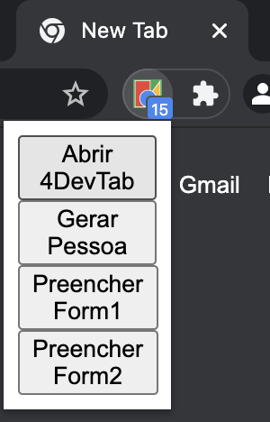

# Chrome Extension to use 4Dev Data

This extension was made to help me in my team to test real data in your project.

## How to Install

- Open the Extension Management page by navigating to ``chrome://extensions``.

- Enable Developer Mode by clicking the toggle switch next to Developer mode.

- Click the Load unpacked button and select the extension directory.

## How to Use

- First you need click in ``Abrir 4DevTab`` to open the website.

- Second you need click in ``Gerar Pessoa`` in the website **4Dev** to generate more people.

- Third with the people generated click to fill the forms.

